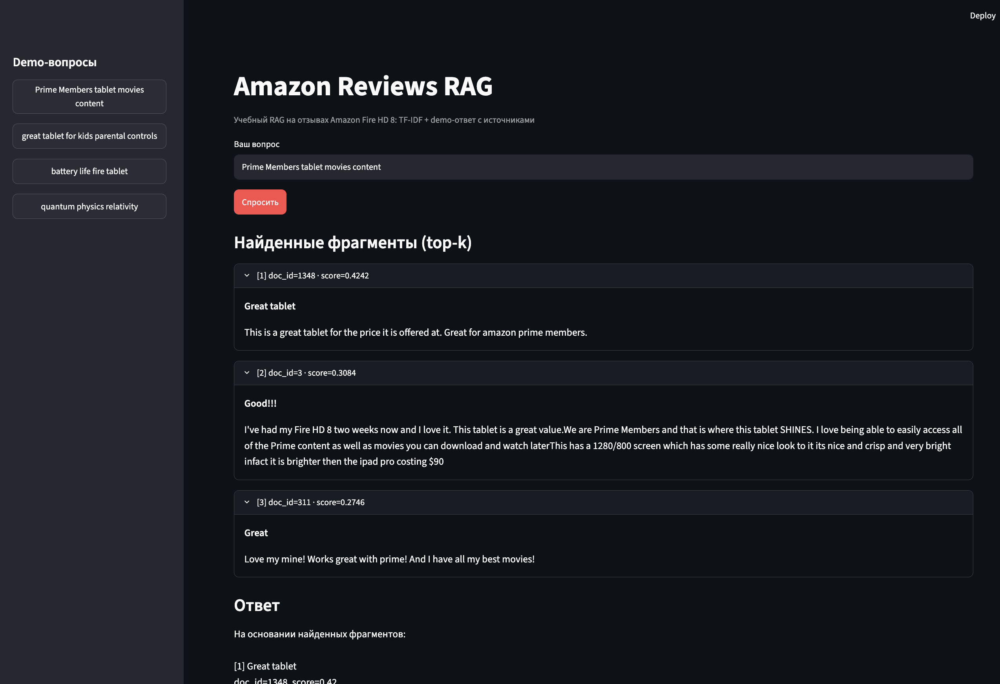
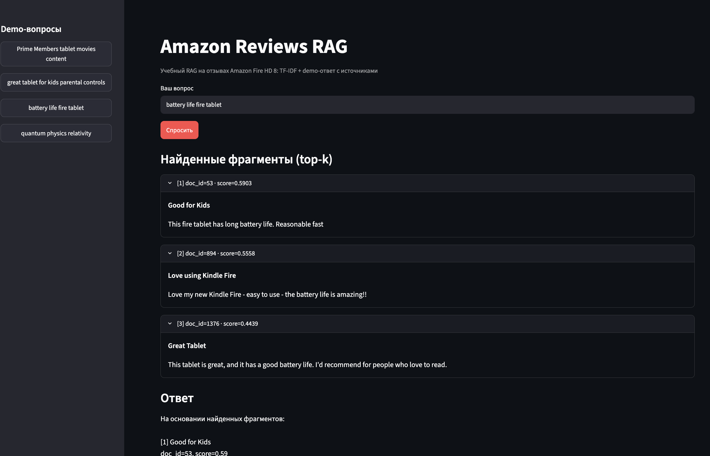
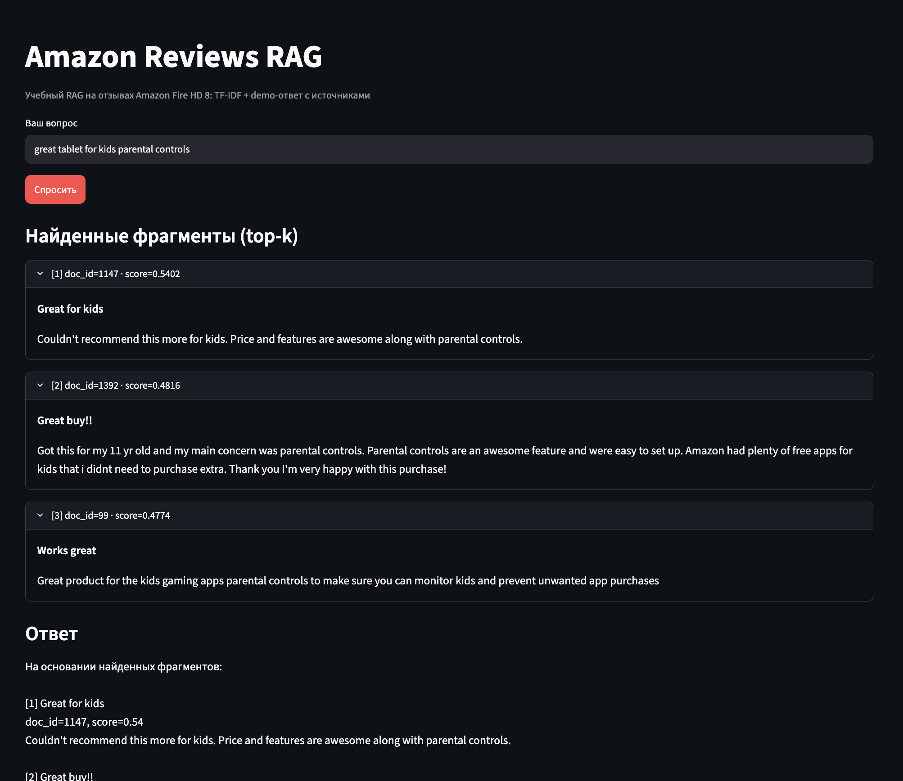
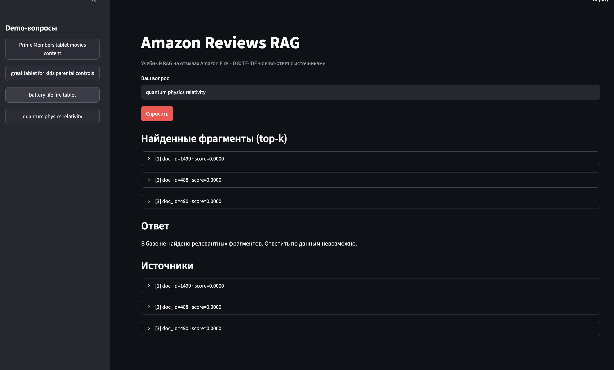

# Amazon Reviews RAG

Учебный RAG на отзывах Amazon Fire HD 8: TF-IDF + demo-ответ с источниками.  
Pipeline: данные → чанки → индекс → поиск → ответ.

**Автор:** Силин Иван Андреевич · **Данные:** [doc/DATA.md](doc/DATA.md) · **Домашнее задание:** [homework/SUBMISSION.md](homework/SUBMISSION.md)

## Требования

- Python 3.10+
- [uv](https://docs.astral.sh/uv/) (или `python3 -m venv .venv`)

## Быстрый старт

```bash
# 1. Окружение
uv venv
uv sync

# 2. Сборка индекса (ingest + chunk + TF-IDF)
uv run python scripts/build_index.py (или как fallback: python scripts/build_index.py )

# 3. Запуск UI
uv run streamlit run app/main.py (или как fallback: streamlit run app/main.py)
```

Откройте в браузере: [http://localhost:8501](http://localhost:8501)

## Данные

- **Источник:** [Amazon Consumer Reviews](https://www.kaggle.com/datasets/datafiniti/consumer-reviews-of-amazon-products) (выборка из `1429_1.csv`)
- **Корпус:** 1500 отзывов → 1597 чанков после нарезки
- **Подготовка:** `data/raw/extract.py` → `data/raw/datasets.json`

## Demo-вопросы

В sidebar приложения или в поле ввода:


| Вопрос                                      | Ожидание                                    |
| ------------------------------------------- | ------------------------------------------- |
| **Prime Members tablet movies content**     | ответ с источниками, score > 0.15           |
| **great tablet for kids parental controls** | ответ про детский режим / parental controls |
| **battery life fire tablet**                | ответ про battery life                      |
| **quantum physics relativity**              | отказ (нет релевантных фрагментов)          |


Другие рабочие запросы: `e-reader reading books`, `SD card storage`, `Skype video call`.

### Проверка из консоли (логи)

```bash
uv run python scripts/check_retrieval.py
uv run python scripts/check_generator.py
```

Пример вывода `check_generator.py` для negative-вопроса:

```
--- Negative: «quantum physics relativity» ---
Ответ:
В базе не найдено релевантных фрагментов. Ответить по данным невозможно.
```

## Тесты

```bash
uv run pytest tests/ -v
```

## Структура проекта

```
rag-tutorial/
├── app/
│   ├── config.py       # пути, top_k, размер чанка
│   ├── chunker.py      # нарезка текста
│   ├── retriever.py    # TF-IDF + cosine top-k
│   ├── generator.py    # demo-ответ
│   ├── prompts.py      # правила и отказы
│   └── main.py         # Streamlit UI
├── scripts/
│   ├── ingest.py
│   ├── build_index.py
│   ├── check_retrieval.py
│   └── check_generator.py
├── data/
│   ├── raw/
│   │   ├── datasets.json   # 1500 отзывов (коммитится)
│   │   └── extract.py      # подготовка из CSV
│   ├── processed/          # documents.jsonl, chunks.jsonl (генерируются)
│   └── index/              # vectorizer.pkl, matrix.npz (генерируются)
├── tests/
└── doc/
```

## Пересборка индекса

После изменения `data/raw/datasets.json`:

```bash
uv run python scripts/build_index.py
```

## Ограничения MVP

- Поиск по **словам** (TF-IDF), не по смыслу — синонимы могут не находиться.
- Demo-режим: ответ из найденных чанков, без внешней LLM.
- Индексируется только текст отзывов, сырой CSV не используется в runtime.

## Улучшения

См. [homework/STUDENT_IMPROVEMENTS.md](homework/STUDENT_IMPROVEMENTS.md).

## Скриншоты

**Релевантный запрос** — «Prime Members tablet movies content»: найдены фрагменты с `doc_id` и `score`, ответ собран из источников.


**Релевантный запрос** — «battery life fire tablet»: найдены фрагменты с `doc_id` и `score`, ответ собран из источников.


**Релевантный запрос** — «great tablet for kids parental controls: найдены фрагменты с `doc_id` и `score`, ответ собран из источников.


**Negative-запрос** — «quantum physics relativity»: релевантных фрагментов нет, система отказывается отвечать.

